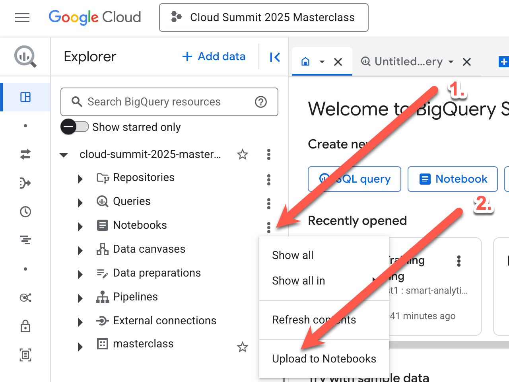
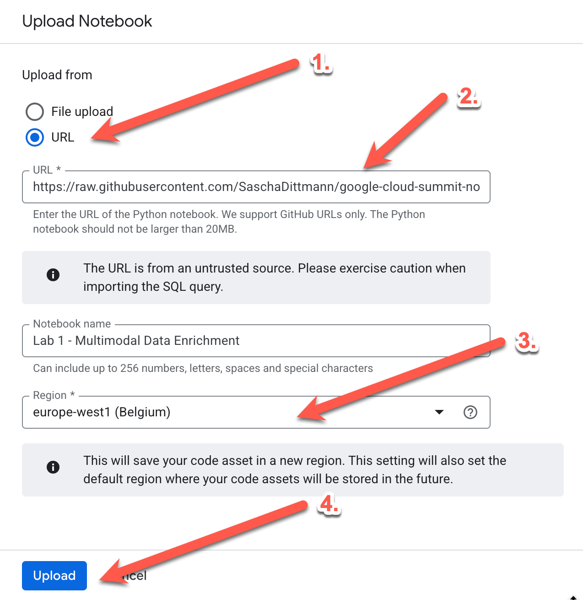

# Data Lakehouse Mastery Masterclass

## Google Cloud Summit  2025 - Zürich

Welcome to the *Data Lakehouse Mastery: Unleashing the Potential of Generative AI on your data* masterclass repository! This project contains all the necessary resources, code examples, and setup instructions for participants of the Data Analytics Masterclass taking place at the Google Cloud Summit 2025 in Zürich.

## Masterclass Overview

Are you ready to revolutionize how you interact with your data? In today's fast-paced, data-driven world, the fusion of data, machine learning, and generative AI is changing everything. We'll dive deep into practical techniques on how to leverage our cutting-edge GenAI models to supercharge your data extraction, writing and enhancing complex SQL queries, creating stunning visualizations, and even integrating GenAI directly into your query results.

## Prerequisites

Before attending the masterclass, please ensure you have:

- A Google Cloud Platform account
- Basic understanding of SQL and data concepts
- Familiarity with Python (recommended but not required)
- Your own laptop with a modern web browser

## Setup Instructions

### 0. Ensure APIs are enabled

- [Compute Engine API](https://console.cloud.google.com/marketplace/product/google/compute.googleapis.com)
- [Cloud Resource Manager API](https://console.cloud.google.com/marketplace/product/google/cloudresourcemanager.googleapis.com)

### 1. Clone this Repository

```bash
git clone https://github.com/webquake/google-cloud-summit-zurich-2025-masterclass.git
cd google-cloud-summit-zurich-2025-masterclass
```

### 2. Set Up Google Cloud Environment

1. Create or select a Google Cloud project
2. Run `deploy.sh` to deploy the required resources

```bash
./deploy.sh
```

### 3. Import the Colab / Jupyter Notebooks

Import the Colab / Jupyter Notebooks from the `notebooks` directory into your BigQuery Studio environment.

1. Open BigQuery Studio
2. Click on the ... menu behind the "Notebooks" section and select "Upload to Notebooks"



3. Select "URL" and paste the URL of the first notebook: 
https://raw.githubusercontent.com/webquake/google-cloud-summit-zurich-2025-masterclass/refs/heads/master/notebooks/Lab%201%20-%20Multimodal%20Data%20Enrichment.ipynb

4. Select the region "europe-west1"

5. Click the "Upload" button on the bottom of the page



6. Repeat the process for the second notebook:
https://raw.githubusercontent.com/webquake/google-cloud-summit-zurich-2025-masterclass/refs/heads/master/notebooks/Lab%202%20-%20Building%20a%20SQL-Powered%20RAG%20Pipeline.ipynb

## Workshop Agenda

1. Introduction to data lakehouses
2. Setting up your Google Cloud environment
3. Data ingestion strategies
4. Building ETL/ELT pipelines
5. Implementing data governance
6. Analytics and ML on the lakehouse
7. Best practices and optimization techniques

## Additional Resources

- [Google Cloud Documentation](https://cloud.google.com/docs)
- [BigQuery Documentation](https://cloud.google.com/bigquery/docs)
- [Vertex AI Documentation](https://cloud.google.com/vertex-ai/docs)

## Support

If you have any questions before or during the workshop, please contact the workshop facilitators or create an issue in this repository.

## License

This project is licensed under the [MIT License](LICENSE).
